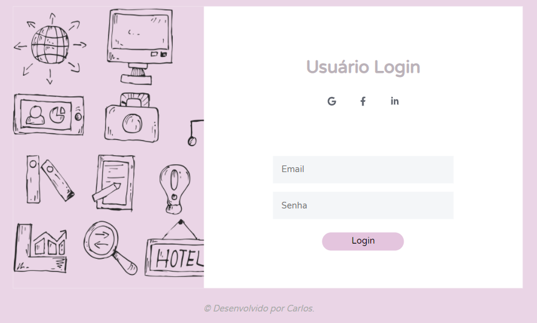

# Simple Login Page HTML5 and CSS3
Minha primeira página de login feita.

## O que foi feito:
- [x] Utilizando a ferramenta Grid e Flexbox.
- [x] Criando o grid template.
- [x] Criando os inputs com o HTML.
- [x] Estilizando os inputs.
- [x] Página de cadastro.
- [ ] Página do usuário.
- [ ] Responsivel para mobile.
- [ ] Implementando o back-end.

## Resultado Final:

### Login:

## Cadastro:

## Perfil:

